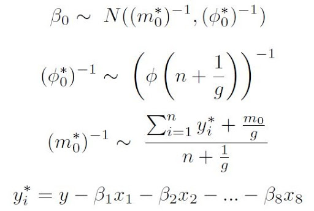
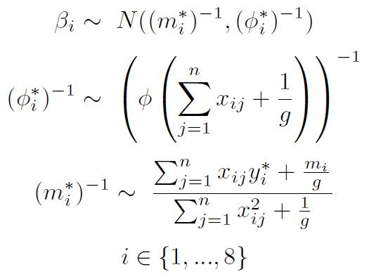

# Bayesian Regression
This is an attempt at creating a Bayesian Regression model using a slimmed down version of credit card default rates using kmean clustering. Note that if you see any errors / issues, please let me know and open an issue.
- Priors: Normal Distribution
- 
- 
- Bayesian_Logistic_Modeling.R is the script that goes through the Bayesian Regression Model (Attempting to write Gibbs sampler from scratch)
- Kmeans_scaled_data100.csv data set that is used.
- kmeans_data.r script used to clean the data for Bayesian Analysis
- subset_credit_card_data.csv is a subset of my original data that I used for the bayesian analysis. Note that the original dataset is too large for github.
- Associated YouTube video:  [**Link to Bayesian Regression Video**](https://youtu.be/s1Pm0oHPGT4)
